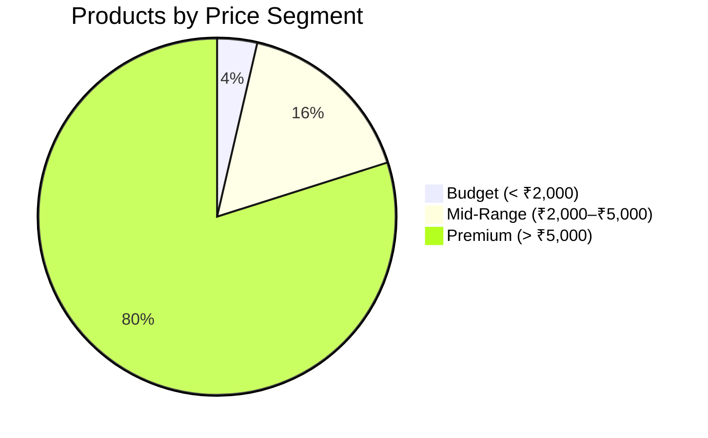
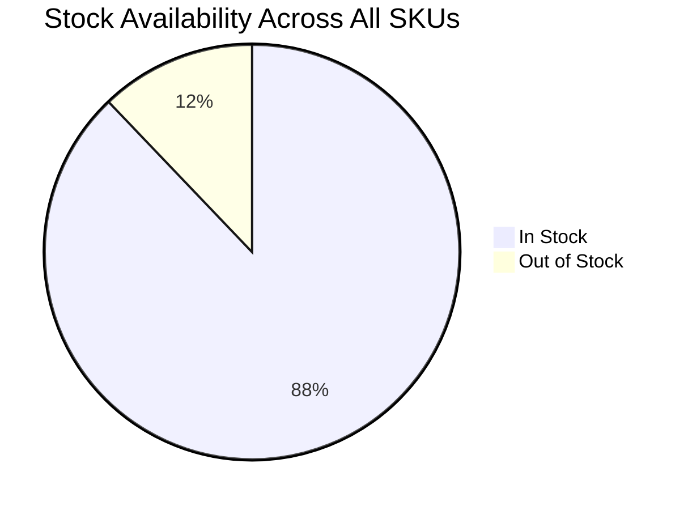
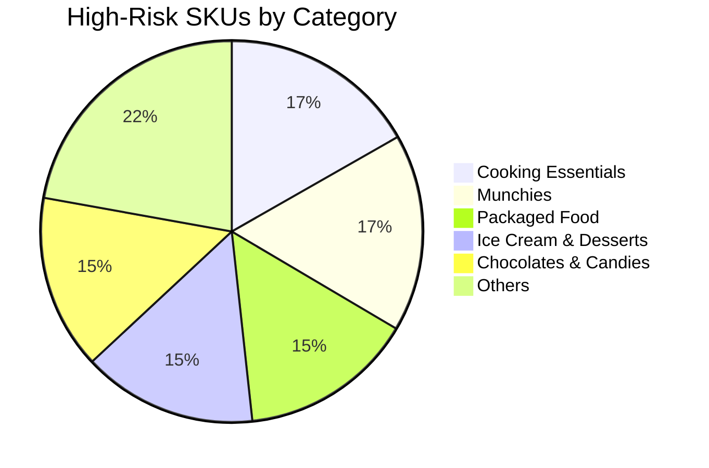
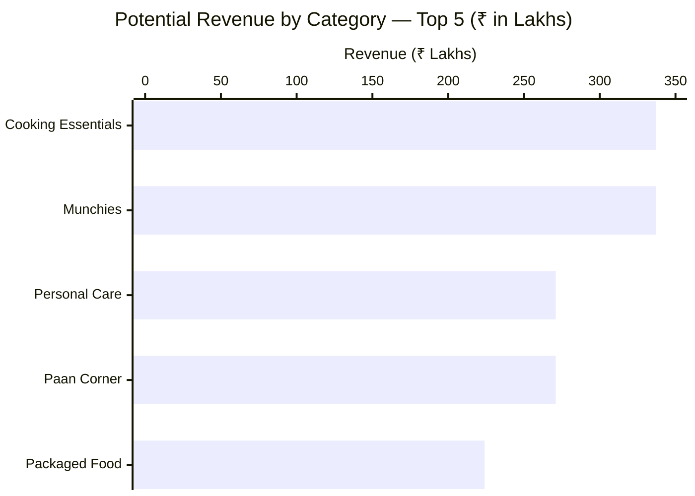

# Zepto Dark Store — Inventory & Pricing Analysis

A SQL project analyzing SKU-level inventory data for a quick-commerce dark store. The goal was to find where the business is quietly losing money — through over-discounting, stagnant stock, and high-value items sitting exposed on shelves.

Built entirely in PostgreSQL.

---

## What I was trying to answer

Quick-commerce is a margin game. A dark store with 500+ SKUs across categories like Dairy, Snacks, and Electronics has a lot of places where small inefficiencies compound into real losses. I wanted to find three things specifically:

- Which products are being discounted when they don't need to be?
- Which items are occupying shelf space without generating velocity?
- Which lightweight, high-value SKUs are shrinkage risks?

---

## Dataset

Simulated SKU-level inventory table modeled after quick-commerce product structures (~500 products across multiple categories).

| Column | Description |
|---|---|
| `PRODUCT` | Product name |
| `CATEGORY` | Product category (Dairy, Snacks, Electronics, etc.) |
| `MRP` | Maximum Retail Price |
| `DISCOUNTED_SELLING_PRICE` | Actual selling price after discount |
| `DISCOUNT_PERCENT` | Promotional discount applied |
| `AVAILABLE_QUANTITY` | Units in stock (max shelf capacity = 6 units per SKU) |
| `WEIGHT_IN_GMS` | Unit weight, used for price-per-gram density analysis |
| `OUT_OF_STOCK` | Boolean availability flag |


---

## Project structure

```
zepto_inventory_analysis/
│
├── Dataset/
│   ├── zepto_v1.csv
│   └── zepto_v2.csv
│
├── SQL_Scripts/
│   ├── 01_Data_Setup_and_Cleaning.sql
│   ├── 02_Exploratory_Descriptive_Analysis.sql
│   ├── 03_Intermediate_Business_Simulations.sql
│   └── 04_Advanced_Analytic_Insights.sql
│
└── README.md
```


---

## SQL techniques used

- **Window functions** — `DENSE_RANK()` and `SUM() OVER (PARTITION BY)` for category-level benchmarking and revenue contribution percentages
- **CTEs** — multi-stage logic broken into readable, named steps
- **Conditional aggregation** — `CASE WHEN` inside `SUM()` for the KPI dashboard query
- **Correlation** — `CORR()` to test whether discount depth relates to stock levels per category
- **Safe division** — `NULLIF()` in all price-per-gram calculations to handle zero-weight records cleanly
- **Subquery aliasing** — properly aliased derived tables for PostgreSQL compatibility

> **Inventory Risk Model - "Luxury Anchors" (High MRP + Low Demand Proxy)**


---

## What I found

### 1. Premium products are being discounted for no reason

Items with MRP above ₹5,000 carry an average discount of **8.4%** and make up **79.9% of all SKUs** (2,982 out of 3,732). These are high-ticket items — discounting them doesn't meaningfully drive volume, it just quietly bleeds margin. Capping premium-tier discounts at 4% and redirecting that promotional budget to mid-range products (where discounts actually move units) would protect gross margin without affecting sell-through.

**Product count by price segment:**




---

### 2. Some shelves are full and completely stagnant

There's a cluster of SKUs sitting at maximum bin capacity (6 units) with 0% discount and no promotional activity. They're occupying prime dark store real estate while generating zero velocity. A targeted 20–25% flash clearance on these specific SKUs would free up shelf space for faster-moving goods and improve overall inventory turnover.

**Overall stock availability:**




---

### 3. The most expensive items by weight are sitting unsecured

Price-per-gram analysis surfaces items like premium saffron and compact electronics — lightweight products with very high MRPs. These are exactly the kind of items that disappear through operational mishandling or shrinkage. Moving the top 10 highest price-per-gram SKUs to monitored shelving is a low-effort, high-impact operational change.

**High-risk inventory concentration by category:**




---

## Key queries at a glance

| Analysis | Technique | What it answers |
|---|---|---|
| Revenue contribution per product | `SUM() OVER (PARTITION BY)` | What % of category revenue does each SKU drive? |
| Top 3 SKUs per category | `DENSE_RANK()` + CTE | Which products to prioritize for restocking? |
| Luxury Anchor risk model | Subquery + window avg | Which above-average-priced items are stagnating? |
| Margin Bleeders | Multi-condition filter | Where is discount spend generating no return? |
| Price-band KPI dashboard | `CASE WHEN` + `GROUP BY` | Budget / Mid / Premium segment breakdown |
| Shrinkage flag | Price-per-gram ranking | Which SKUs need secured shelving? |


---

## Revenue by category



---

## Assumptions

- COGS is assumed at 70% of MRP, giving a 30% gross margin baseline
- Dataset: 3,732 SKUs across 14 categories
- Total potential revenue (in-stock): ₹22.43 Crore
- Average discount across all products: 7.62% | OOS rate: 12.14%
- `AVAILABLE_QUANTITY = 6` represents a full bin slot in the dark store
- Price segments: Budget (< ₹2,000), Mid-Range (₹2,000–₹5,000), Premium (> ₹5,000)
- Correlation analysis (`CORR()`) is exploratory given the simulated dataset — treat directional signals with appropriate skepticism

---

## Tech stack

PostgreSQL · SQL


**Role: Data Analyst — Sales & Logistics Operations** 

 
 **Others Project -**
 
 1) https://github.com/Kaif39211/pharmaceutical-inventory-analysis-SQL 
                                              
    
2) https://github.com/Kaif39211/KM_Logistics_2022_Analysis.xlsx


                      
## **Contact: [LinkedIn](http://www.linkedin.com/in/kaif-mahaldar-18300b333) | [Email](mailto:kaifmahaldar5@gmail.com)**
